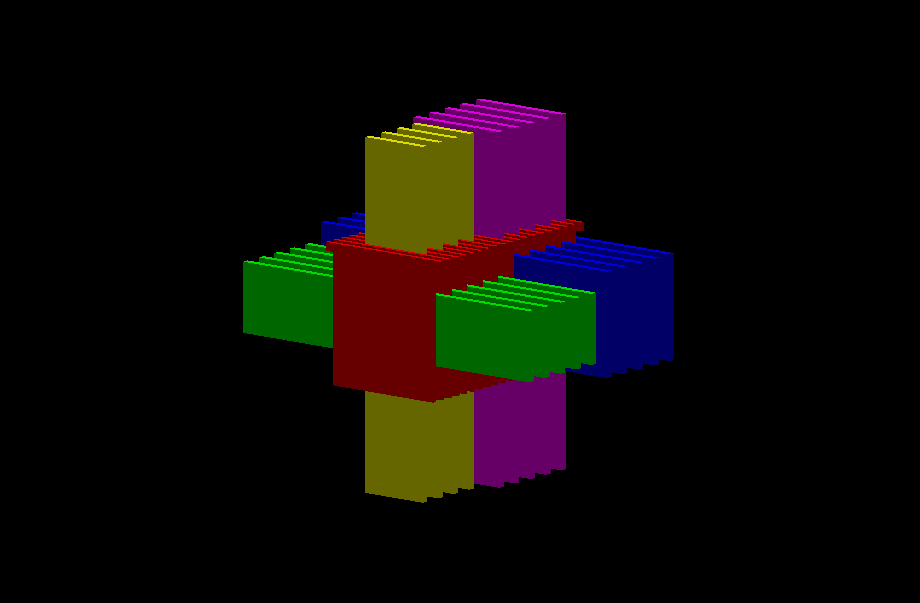

# Table of Contents

1.  [The prototype geometry](#geometry)
2.  [Structure of the geometry description](#structure)
3.  [Reference](#reference)
    1.  [Constants](#constants)
    2.  [Solids](#solids)
    3.  [Logical volumes](#logical_volumes)
    4.  [Physical volumes](#physical_volumes)
        1.  [Notes on the CopyNumber](#copy_numbers)
    5.  [User information](#user_information)
    6.  [Python code with all variables for testing](#python_code)

## The prototype geometry

This document describes the current version of the GDML description of the LDMX testbeam prototype. The hadronic calorimeter prototype, shown below, is a sampling calorimeter with steel absorber plates and alternating layers of polystyrene scintillator bars. There are in total 19 layers, divided into two regions with 8 (shown in green below) and 12 (shown in blue below) scintillator bars per layer respectively. 

The scintillator bars are currently not represented individually in the geometry description and are treated as a single box of scintillator material. 

# Structure of the geometry description

The geometry is divided into several files to make working with it easier.

-   [detector.gdml](./detector.gdml) This is the entrypoint of the geometry. Contains the actual implementation of the prototype geometry using the definitions from [hcal_volumes.gdml](./hcal_volumes.gdml)
-   [constants.gdml](./constants.gdml) Contains variable definitions used elsewhere in the geometry such as positions and geometrical properties of different volumes.
-   [materials.gdml](./materials.gdml) Contains definitions of isotopes and materials
-   [userinfo.gdml](./userinfo.gdml) Contains auxiliary information (see the
    [GDML manual](https://gdml.web.cern.ch/GDML/doc/GDMLmanual.pdf) for details), such as sensitive detector volumes, visualization information, version and author information.
-   [hcal_solids.gdml](./hcal_solids.gdml) Contains definitions of the absorber, scintillator, and parent boxes
-   [hcal_volumes.gdml](./hcal_volumes.gdml) Contains the definition of the scintillator and absorber volumes

# Reference

The following is a list of all the variables defined in the protoype geometry description.

## Constants

-   `center`, `identity`, and `hadron_calorimeter_pos` are positions that are all defined as **(x,y,z) = (0,0,0)**. `hadron_calorimeter_pos` is used to place the `prototype_volume` physical volume within the `World` volume.
-   `world_dim` is the size of the sides of the &ldquo;world_box&rdquo; box, set to **10 m**
-   `air_thick` is the thickness (&Delta; zair) of the layers of air in between the absorber and scintillator bars. The thickness of each region is set to **2 mm**, which contributes twice to the thickness of an individual layer.
-   `absorber_width` is the width (&Delta; xabsorber,&Delta; yabsorber) of an absorber layer, set to **800 mm**
-   `absorber_ears`, TODO: Document this, set to **50 mm**
-   `absorber_thickness` is the thickness (&Delta; zabsorber) of an absorber layer, set to **25 mm**
-   `scint_thick` is the thickness of a scintillator bar layer (&Delta; zscintillator). This is equivalent to the thickness of an individual scintillator bar and is set to **20 mm**
-   `scint_bar_width` is the width of an individual scintillator bar, it is set to **50 mm**.
-   `scint_bar_length` is the length of an individual scintillator bar. In horizontal layers, this is equivalent to the width (&Delta; xscintillator) of the layer while in vertical layers it is equivalent to the height (&Delta; yscintillator) of the layer. It is set to **2000 mm**.
-   `layer_thick` is the combined thickness of a layer (&Delta; zlayer). It consists of one layer of absorber, `absorber_thickness`, one layer of scintillators, and *two* layers of air, `air_thick`. The resulting layer thickness is thus given by `absorber_thickness + scint_thick + 2 * air_thick`, **49 mm**
-   `num_bars_front` is the number of scintillator bars in the front region. It is set to **8**
-   `num_bars_back` is the number of scintillator bars in the back region. It is set to **12**
-   `double_layer_thick` is twice the thickness of one layer, i.e. **98 mm. It is currently only used in defining the total depth of the prototype, `dz`.
-   `num_layers_front` is the total number of layers in the front region of the prototype and is set to **9**
-   `num_layers_front_vert` and `num_layers_front_hori` are the number of vertical/horizontal layers in the front region. They are set to **4** and **5** respectively
-   `num_double_layers_back` is the number of horizontal or vertical layers in the back region. It is set to **5** so the total number of layers in the back region is **10**
-   `num_layers` is the total number of layers. It is set to **19** and corresponds to `num_layers + 2 * num_double_layers_back`
-   `back_start` is the location of the first layer in the back region. It is set to `num_layers_front * layer_thick`, i.e. **441 mm**
-   The length of the sides of the various scintillator layers are defined as
    -   Front vertical layers have `scint_front_vertical_x` which is **400 mm**, `scint_front_vertical_y` which is the bar length, **2000 mm**. The 400 mm corresponds to 8 bars each having a width of **50 mm**, `num_bars_front * scint_bar_width`
    -   Front horizontal layers have `scint_front_horizontal_y` which is **400 mm**, `scint_front_horizontal_x` which is the bar length, **2000 mm**. The 400 mm corresponds to 8 bars each having a width of **50 mm**, `num_bars_front * scint_bar_width`
    -   Back vertical layers have `scint_back_vertical_x` which is **600 mm**, `scint_back_vertical_y` which is the bar length, **2000 mm**. The 600 mm corresponds to 12 bars each having a width of **50 mm**, `num_bars_back* scint_bar_width` 
    -   Back horizontal layers have `scint_back_horizontal_y` which is **600 mm**, `scint_back_horizontal_x` which is the bar length, **2000 mm**. The 600 mm corresponds to 12 bars each having a width of **50 mm**, `num_bars_back* scint_bar_width` 
-   `dx` and `dy`, the width and height of the prototype respectively are both set to **3000 mm**
-   `dz` is the depth of the prototype and is defined as `num_layers_front * layer_thick + num_double_layers_back * double_layer_thick` which correpsonds to **931 mm**

## Solids

Solids are objects with purely geometrical properties such as a box, a sphere,
or a more complicated geometry

-   `absorber_box` is the solid that represents the absorber layer.
    -   TODO: Document this @petergy
-   There are four boxes representing the four different types of scintillator layers (front vertical, front horizontal, back vertical, back horizontal). These are defined using the corresponding width/height from
    [Constants](#constants), e.g.
    -   `front_vertical_scint_box` has width `scint_front_vertical_x` (400 mm) and height `scint_front_vertical_y` (2000 mm)
    -   `front_horizontal_scint_box` has width `scint_front_horizontal_x` (2000 mm) and height `scint_front_horizontal_y` (400 mm)
    -   `back_vertical_scint_box` has width `scint_back_vertical_x` (600 mm) and height `scint_back_vertical_y` (2000 mm)
    -   `back_horizontal_scint_box` has width `scint_back_horizontal_x` (2000 mm) and height `scint_back_horizontal_y` (600 mm)
-   `air_box` is the a box representing a single air layer and has width `dx` (3000 mm), height `dy` (3000 mm), and depth `air_thick` (2 mm)
-   `prototype_box` is the parent volume for the prototype and is defined as a box with width `dx` (3000 mm), height `dy` (3000 mm), and depth `dz` (931 mm)
-   `world_box` is the parent volume for all the other parts of the geometry and is defined as a box with all sides having length `world_dim` (10 m)

## Logical volumes

In Geant4, a logical volume can contain all of the information about a volume except for its position. This allows you to use one logical volume to create several distinct daughter physical volumes. The position and rotation of a daughter volume is defined in terms for the mother volume. The logical volumes that we use in this geometry can contain the following tags

-   `<solidref>` is a reference to one of the solids defined in [hcal_solids.gdml](./hcal_solids.gdml)
-   `<materialref>` is a reference to a material defined in [materials.gdml](./materials.gdml)
-   `<auxiliary>` allows us to add any other kind of information that is used by the simulation, such as defining if a volume is supposed to be a sensitive element or how the volume should be visualized by default. Most auxiliary tags will be references to groups of properties defined in [User information](#user_information).
-   `<physvol>` any daughter volumes that are to be placed within the logical volume, see [Physical volumes](#physical_volumes)

Furthermore, each logical volume has a name as part of the `<volume>` tag which can be used to refer to the volume using the `<volumeref>` tag. At least one logical volume has to be the &ldquo;World&rdquo; volume. This volume determines the global coordinate system and has to completly contain all other volumes, sharing surfaces with none of them.

-   `World` is the &ldquo;World&rdquo; volume. It is defined in [detector.gdml](./detector.gdml)
    -   Material: `G4_AIR`
    -   Solid: `world_box`
    -   Daughter volumes:
        -   `prototype_volume`
    -   Auxiliary information:
        -   &ldquo;DetElem&rdquo;: &ldquo;Top&rdquo;
-   `prototype_volume` represents the entire prototype and is defined in [detector.gdml](./detector.gdml)
    -   Material: `G4_AIR`
    -   Solid: `prototype_box`
    -   Daughter volumes:
        -   `absorber_physvol`
        -   `front_horizontal_scint_physvol`
        -   `front_vertical_scint_physvol`
        -   `back_horizontal_scint_physvol`
        -   `back_vertical_scint_physvol`
    -   Auxiliary information:
        -   &ldquo;Region&rdquo;: &ldquo;CalorimeterRegion&rdquo;
        -   &ldquo;VisAttributes&rdquo;: &ldquo;HcalVis&rdquo;
        -   &ldquo;DetElem&rdquo;: &ldquo;Hcal&rdquo;
-   `absorber_volume` represents one layer of the steel absorber and is defined in [hcal_volumes.gdml](./hcal_volumes.gdml)
    -   Material: `Steel`
    -   Solid: `absorber_box`
    -   Auxiliary information:
        -   &ldquo;Color&rdquo;: &ldquo;Red&rdquo;
        -   &ldquo;VisAttributes&rdquo;: &ldquo;HcalVis&rdquo;
-   There are four volumes representing each of the four different types of scintillator layers called `front_vertical_scint_box_volume`, `front_horizontal_scint_box_volume`, `back_vertical_scint_box_volume`, and `back_horizontal_scint_box_volume`, all defined in [hcal_volumes.gdml](./hcal_volumes.gdml). They differ in name and which corresponding solid they make use of
-   Material: &ldquo;Scintillator&rdquo;
-   Solid: One of `front_vertical_scint_box`, `front_horizontal_scint_box`, `back_vertical_scint_box`, and `back_horizontal_scint_box`
-   Auxiliary information:
    -   &ldquo;SensDet&rdquo;: &ldquo;HcalSD&rdquo;
    -   &ldquo;Color&rdquo;: &ldquo;Blue&rdquo;
    -   &ldquo;VisAttributes&rdquo;: &ldquo;HcalVis&rdquo;

## Physical volumes

A physical volume is a logical volume with a position and, optionally, a name and a so-called CopyNumber. The CopyNumber should be *unique* for each physical volume. In LDMX-sw, the CopyNumber is used to identify which readout-channels a given physical volume corresponds to so some care must be taken when working on the geometry to ensure that the position of the physical volume and the corresponding CopyNumber aligns. For details see [Notes on the CopyNumber](#copy_numbers).

-   The physical volume representing the prototype volume is unnamed
    -   Mother volume: `World`
    -   Logical volume: `prototype_volume`
    -   Position: `hadron_calorimeter_pos`
    -   Rotation: `identity`
-   `absorber_physvol`: There are 19 physical volumes representing the absorber layers
    -   Logical volume: `absorber_volume`
    -   Mother volume: `prototype_volume`
    -   CopyNumbers: [1 .. 19]
    -   Position of the first layer:
        -   x: **-400 mm**
        -   y: **-400 mm**
        -   z: `-dz/2`, i.e. **-465.5 mm**
    -   Distance (z) to subsequent layer: `layer_thick`, i.e. **49 mm**
-   `front_horizontal_scint_physvol`: There are 5 physical volumes representing the horizontal scintillator layers in the front region. They all have odd CopyNumbers.
    -   Logical volume: `front_horizontal_scint_box_volume`
    -   Mother volume: `prototype_volume`
    -   CopyNumbers: [1,3,5,7,9]
    -   Position of the first layer:
        -   x: **0 mm**
        -   y: **0 mm**
        -   z: `-dz/2 + absorber_thickness + air_thick + scint_thick/2`, i.e. **-428.5 mm**
    -   Distance (z) to subsequent layer: `double_layer_thick`, i.e. **98 mm**
-   `front_vertical_scint_physvol`: There are 4 physical volumes representing the vertical scintillator layers in the front region. They all have even CopyNumbers.
    -   Logical volume: `front_vertical_scint_box_volume`
    -   Mother volume: `prototype_volume`
    -   CopyNumbers: [2,4,6,8]
    -   Position of the first layer:
        -   x: **0 mm**
        -   y: **0 mm**
        -   z: `-dz/2 + absorber_thickness + air_thick + scint_thick/2 + layer_thick`, i.e. **-379.5 mm**
    -   Distance (z) to subsequent layer: `double_layer_thick`, i.e. **98 mm**
-   `back_vertical_scint_physvol`: There are 5 physical volumes representing the vertical scintillator layers in the back region. They all have even CopyNumbers.
    -   Logical volume: `back_vertical_scint_box_volume`
    -   Mother volume: `prototype_volume`
    -   CopyNumbers: [10, 12, 14, 16, 18]
    -   Position of the first layer:
        -   x: **0 mm**
        -   y: **0 mm**
        -   z: `-dz/2 + back_start + absorber_thickness + air_thick + scint_thick/2`, i.e. **12.5 mm**
    -   Distance (z) to subsequent layer: `double_layer_thick`, i.e. **98 mm**
-   `back_horizontal_scint_physvol`: There are 5 physical volumes representing the horizontal scintillator layers in the back region. They all have odd CopyNumbers.
    -   Logical volume: `back_horizontal_scint_box_volume`
    -   Mother volume: `prototype_volume`
    -   CopyNumbers: [11, 13, 15, 17, 19]
    -   Position of the first layer:
        -   x: **0 mm**
        -   y: **0 mm**
        -   z: `-dz/2 + back_start + layer_thick + absorber_thickness + air_thick + scint_thick/2`, i.e. **61.5 mm**
    -   Distance (z) to subsequent layer: `double_layer_thick`, i.e. **98 mm**

### Notes on the CopyNumber

For the hadronic calorimeter, the CopyNumber encodes the layer number and the section number of the scintillators. The section number refers to the five distinct sections of the full LDMX Hcal (Back, Top, Bottom, Left, Right). The prototype geometry consists entirely of the &ldquo;Back&rdquo; section of the Hcal which has section number **0**. The section number is derived from the CopyNumber by taking the modulo of the CopyNumber with **1000**

The layers of the protoype are numbered from 1 to 19 (note the non-zero based indexing). The layer number is derived from the CopyNumber by dividing the CopyNumber with **1000** and taking the remainder.

TODO: @PeterGy, document the CopyNumber requirements for the trigger scintillator.

Furthermore, the rotation of the layer is determined by the layer number, which in turn depends on the CopyNumber. An even CopyNumber means a vertical layer (length of the bars is along the y-axis) while an odd CopyNumber

## User information

## Python code with all variables for testing

[prototype-geometry-reference.py](./code/prototype-geometry-reference.py) is a short python script containing definitions for all of the variables used to describe the physical volumes that can be used to test or calculate. All units are **mm**

